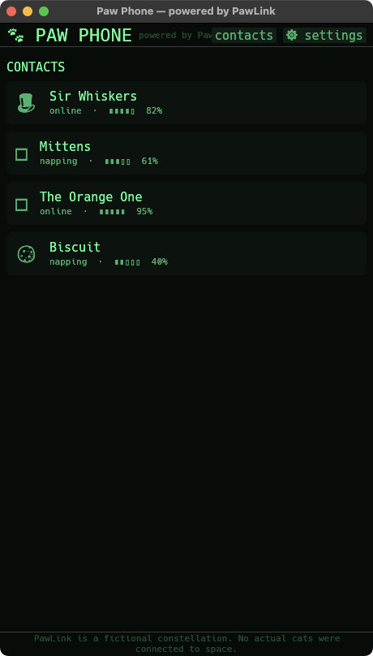

# 🐾 Paw Phone — powered by PawLink™

A whimsical macOS desktop toy where cats message each other over a **fictional**
satellite constellation called **PawLink** (a loving parody of Starlink). The
joke and ~80% of the polish live in the **uplink ceremony**: every time you send
a message the app theatrically "acquires PawLink satellites," runs a dial-up-style
handshake, locks signal, transmits, and receives a reply — with **procedurally
synthesized audio** generated live and synced to the connection state machine.

There is **no backend, no networking, no real satellites**. The other cat is
simulated on-device. That is an architectural invariant, not an afterthought.

> *PawLink is a fictional constellation. No actual cats were connected to space.*



*Above: the contacts screen (a real capture of the running app). Below: the
full-screen uplink HUD that takes over during a send —*

```
        PAWLINK UPLINK TERMINAL                🎩 Sir Whiskers
                  .      o
              .         (sat)   .
                 \   __        .
            o ----  (🐱)  ---- o          <- birds orbit; lit = acquired
                 /    ‾‾    \
              .        o       .
                  ACQUIRING PAWLINK
              ▮▮▮▮▮▮▮▯▯▯▯▯   (signal bars climb)
        > ACQUIRING PAWLINK SAT 7 OF 12 · AZ 218° EL 41° · RSSI -71dBm · whisker-aligned
        > HANDSHAKE · FSK warble · Doppler +1.2kHz · purr-rate 24.1Hz
        > _
```

## Stack

- **Rust** (edition 2024), native macOS desktop (built & verified on rustc 1.94).
- **[egui](https://github.com/emilk/egui) / eframe 0.34** — immediate-mode GUI; the
  retro-terminal HUD is drawn with a custom `Painter`.
- **[cpal](https://github.com/RustAudio/cpal) 0.18** — the audio output stream;
  every sound is synthesized sample-by-sample in the render callback.
- **[ringbuf](https://github.com/agerasev/ringbuf) 0.5** — lock-free SPSC queue
  carrying audio events from the connection worker to the audio thread.
- **serde / serde_json** — conversation persistence (a small JSON document store).
- **rand 0.10**, **directories 6**. No networking crates. No `unsafe`.

## Build & run

```bash
cargo run --release
```

First launch seeds four cats and creates a save file at
`~/Library/Application Support/org.PawLink.PawPhone/pawphone.json`.

## How it works

Three actors, with the **connection-phase enum as the contract** between them.

```
            user taps SEND
                  │
   ┌──────────────▼───────────────┐        ┌───────────────────────────┐
   │  PawLinkConnectionManager     │        │   PawPhoneApp (main thread)│
   │  (dedicated worker thread)    │        │   - egui frame loop        │
   │                               │        │   - reads SharedState      │
   │  walks idle → poweringUp →    │  Arc<  │   - persists outcomes      │
   │  acquiring → handshaking →    │  Mutex │◄──polls every frame────────┤
   │  locked → transmitting →      │  >     │                            │
   │  awaitingReply → receiving →  │────────►   draws Contacts / Thread  │
   │  connected | failed           │        │   / HUD / Settings         │
   └───────┬───────────────────────┘        └───────────────────────────┘
           │ lock-free AudioCommand (ringbuf)
   ┌───────▼───────────────────────┐
   │  PawLinkAudioEngine            │   cpal render callback owns a voice
   │  + SynthCore (audio thread)    │   pool; synthesizes each event.
   └────────────────────────────────┘
```

- **`PawLinkPhase`** (`src/phase.rs`) is the single source of truth. `RealismProfile`
  (Instant / Realistic LEO / Dramatic) resolves the duration + probabilities of
  every beat.
- The **state machine** runs on its own thread (the idiomatic Rust form of "drive
  it as an async sequence" — no async runtime needed). It updates `Arc<Mutex<SharedState>>`
  for the UI and pushes audio/haptic events on each transition. The UI thread only
  *reads* that state each frame.
- The **audio engine** is event-driven over a lock-free ring buffer, so the render
  callback never locks the UI mutex — audio cannot desync from, or be blocked by, the UI.
- Persistence (`src/persistence.rs`) stays on the main thread; the worker only
  computes the outcome, and the app applies + saves it.

### Procedural audio (`src/audio/synth.rs`)

Every sound is a `Voice` rendered in the callback — no audio files anywhere:

| Event        | Recipe |
|--------------|--------|
| `power_up`   | 40→120 Hz sine sweep + a sharp relay click transient |
| `acquiring`  | low-pass filtered noise bed ("listening to the void") |
| `ping`       | 1.2 kHz sine burst, exp decay, pitched up per satellite found |
| `handshake`  | dual-tone FSK warble, pseudo-random 800–2400 Hz hops + data scramble, density builds |
| `lock`       | bright major-third confirmation chime |
| `transmit`   | rapid clicky data-chitter grains at randomized intervals |
| `incoming`   | a sawtooth pitch-glide (300→500→250 Hz) through a formant band-pass with vibrato — a recognizable *attempt* at a meow |
| `signal_lost`| descending detuned sweep + a sudden noise-gate dropout |

All in `f32` with short attack/release envelopes (declick) and a `tanh` master
limiter. The render path does no allocation, locking, or panicking.

## 🧑‍💻 Your code lives in `src/personality.rs`

Built in *learning mode* — the app's "soul" is four small, high-leverage functions
left as working-but-naive baselines with design notes. The app runs today; make
them characterful:

1. **`translate_to_meow`** — free text → cat speech (deterministic).
2. **`weighted_reply`** — the other cat's reply, weighted by persona + your message.
3. **`roll_failure`** — the ~5–10% flavored uplink failure roll.
4. **`roll_packet_loss`** — the "reply lost in orbit, please resend" comedy.

Each has a `TODO(you)` block describing the trade-offs to consider.

## Adaptations from the original iOS spec

This was ported from an iOS/SwiftUI/AVAudioEngine/CoreHaptics/SwiftData brief:

- **Haptics** → macOS desktop has no general haptic engine (only Force Touch
  trackpads, via a fixed API). `PawHaptics` is a structured graceful **no-op** with
  the full event vocabulary intact (`src/haptics.rs`), so an iOS/trackpad backend
  drops straight in. The Settings toggle still gates it.
- **SwiftData** → a pure-Rust JSON document store (avoids a fragile bundled-SQLite
  C build on bleeding-edge toolchains).
- **async/await sequence** → a worker thread + channel (same intent, no runtime dep).

## Non-goals / guardrails

- **No networking, no entitlements, no backend** — everything is simulated locally.
- No real Starlink/SpaceX assets or names. PawLink is the brand.
- No bundled audio assets — all sound is synthesized at runtime.
